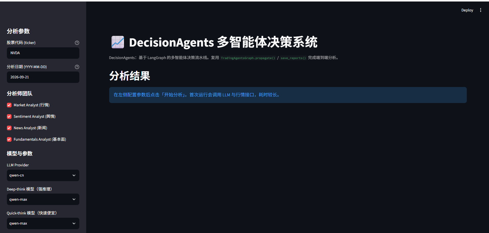
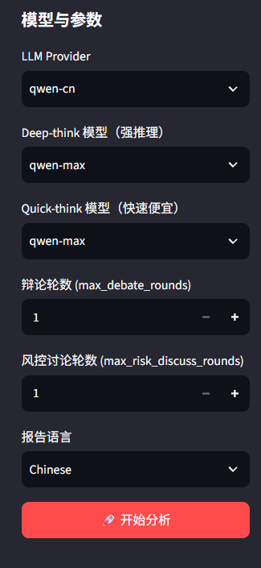
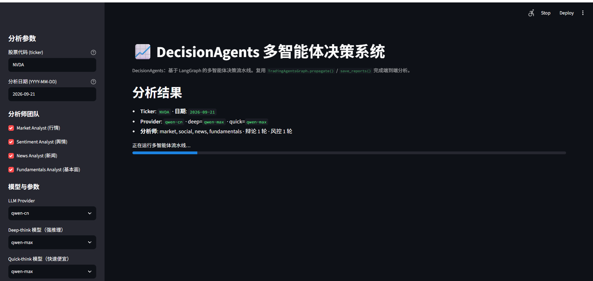
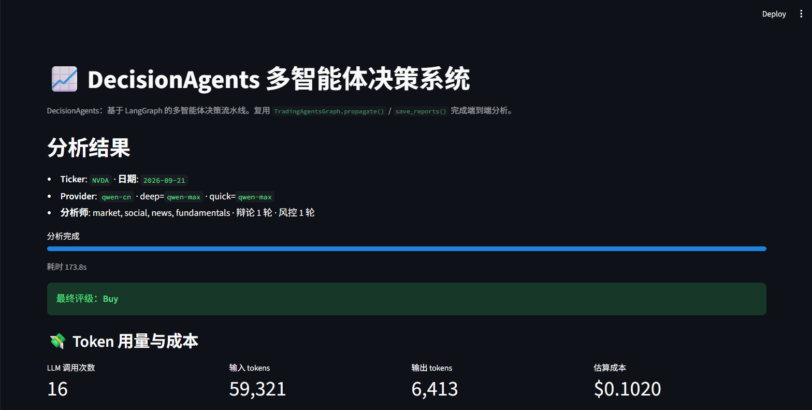
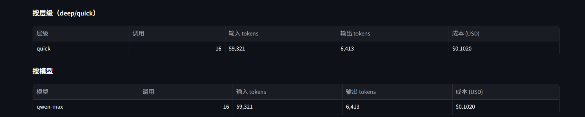
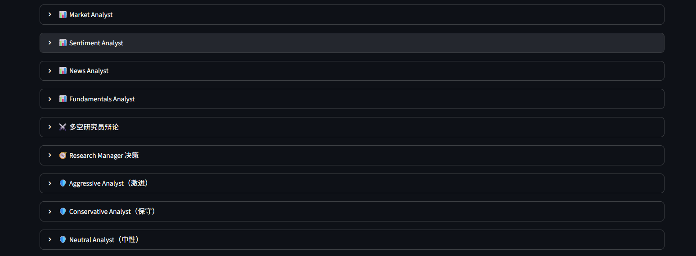
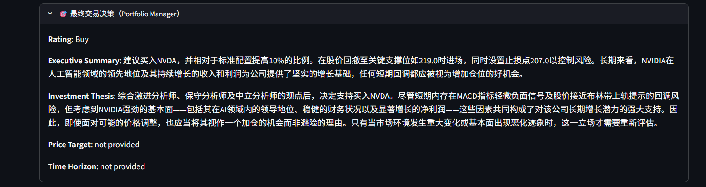

# DecisionAgents：多智能体 LLM 决策系统

DecisionAgents 是一个基于 [LangGraph](https://github.com/langchain-ai/langgraph) 的多智能体决策框架，模拟专业投研团队的协作流程。它部署一组各司其职的 LLM 智能体——分析师、研究员、交易员、风控团队与基金经理——通过结构化辩论协同评估市场状况并输出决策建议。

本仓库聚焦金融交易决策场景：分析师团队并行产出报告 → 多空研究员辩论 → 交易员拟定方案 → 风控三方辩论 → 基金经理最终决策。核心流水线由 `TradingAgentsGraph` 驱动，可通过 Streamlit Web UI 或 Python API 调用。

> DecisionAgents 仅用于研究目的。交易表现受所选基座模型、温度、交易周期、数据质量等多种非确定性因素影响，不构成任何金融、投资或交易建议。

## 界面预览

<p align="center">
  
</p>

## 架构

DecisionAgents 的流水线由 `TradingAgentsGraph` 驱动，依次经过以下阶段：

### 分析师团队

- **基本面分析师**：评估公司财务与业绩指标，识别内在价值与潜在风险信号。
- **舆情分析师**：聚合新闻标题、StockTwits 与 Reddit 讨论，输出单一情绪读数，判断短期市场情绪。
- **新闻分析师**：监控全球新闻与宏观经济指标，解读事件对市场的影响。
- **技术分析师**：利用技术指标（如 MACD 和 RSI）识别交易形态并预测价格走势。

选中的分析师并行工作，各自调用自己的工具，所有报告就绪后启动研究辩论。

### 研究员团队

由多方（看多）与空方（看空）研究员组成，批判性地评估分析师团队提供的洞见。通过结构化辩论，在潜在收益与固有风险之间取得平衡。

### 交易员智能体

汇总分析师与研究员的报告，做出明智的交易决策，确定交易的时机与力度。

### 风控与基金经理

- 风控团队由激进、保守、中性三方分析师组成，持续评估投资组合风险，向基金经理提供评估报告。
- 基金经理批准/否决交易提案，输出最终决策。

## 安装

DecisionAgents 需要 Python 3.11 或更高版本。克隆本仓库并安装：

```bash
git clone <你的仓库地址>
cd DecisionAgents
pip install ".[ui]"          # 安装核心 + Streamlit Web UI
# 如需 Redis 缓存后端：pip install ".[ui,redis]"
```

## 快速开始

1. 复制示例环境文件并填入你的 API Key：

```bash
cp .env.example .env
```

2. 启动 Web UI：

```bash
streamlit run webapp.py
```

在浏览器中打开页面，选择分析师团队、配置模型与辩论轮数，点击「开始分析」即可运行完整流水线。

### 所需 API Key

DecisionAgents 支持多种 LLM 提供商，按需在 `.env` 中设置对应 API Key：

```bash
OPENAI_API_KEY=...          # OpenAI (GPT)
GOOGLE_API_KEY=...          # Google (Gemini)
ANTHROPIC_API_KEY=...       # Anthropic (Claude)
XAI_API_KEY=...             # xAI (Grok)
DEEPSEEK_API_KEY=...        # DeepSeek
DASHSCOPE_API_KEY=...       # 通义千问（国际区）
DASHSCOPE_CN_API_KEY=...    # 通义千问（中国区）
ZHIPU_API_KEY=...           # GLM 智谱（国际区 Z.AI）
ZHIPU_CN_API_KEY=...        # GLM 智谱（中国区 BigModel）
MINIMAX_API_KEY=...         # MiniMax（国际区）
MINIMAX_CN_API_KEY=...      # MiniMax（中国区）
OPENROUTER_API_KEY=...      # OpenRouter
MISTRAL_API_KEY=...         # Mistral
MOONSHOT_API_KEY=...        # Kimi (Moonshot)
GROQ_API_KEY=...            # Groq
NVIDIA_API_KEY=...          # NVIDIA NIM
FRED_API_KEY=...            # FRED 宏观数据（免费，可选）
ALPHA_VANTAGE_API_KEY=...   # Alpha Vantage
TYPESAFE_API_KEY=...        # Jev 舆情筛查（可选）
```

- 本地模型 Ollama：设置 `llm_provider: "ollama"`，默认端点 `http://localhost:11434/v1`，可用 `OLLAMA_BASE_URL` 指向远端。
- 其他 OpenAI 兼容服务（vLLM、LM Studio、llama.cpp、自建中继）：设置 `llm_provider: "openai_compatible"`，用 `backend_url`（或 `TRADINGAGENTS_LLM_BACKEND_URL`）指定端点。

## Web UI 说明

`webapp.py` 是一个轻量浏览器前端，直接复用 `TradingAgentsGraph.propagate()` 与 `save_reports()`，不重写任何分析逻辑。

### 参数面板

左侧参数面板包含：

- **股票代码 (ticker)**：如 `NVDA`、`0700.HK`、`600519.SS`，会走 yfinance 的 symbol 归一化。
- **分析日期**：不能晚于今天；历史日期会触发 point-in-time 数据过滤。
- **分析师团队**：勾选参与本次运行的分析师（行情 / 舆情 / 新闻 / 基本面）。
- **模型与参数**：选择 LLM Provider、deep-think（强推理）与 quick-think（快速便宜）模型、辩论轮数与风控讨论轮数、报告语言。

<p align="center">
  
</p>

### 运行过程

点击「开始分析」后，页面会展示本次运行的配置摘要（Ticker、日期、Provider、模型、分析师、辩论/风控轮数），并显示进度条：

<p align="center">
  
</p>

### 运行结果

分析完成后，结果区依次展示：

**1. 最终评级徽章与 Token/成本看板**

<p align="center">
  
</p>

成本看板按层级（deep/quick）和按模型分别统计调用次数、输入/输出 tokens 与估算成本：

<p align="center">
  
</p>

**2. 分析师报告与辩论过程**

各分析师报告、多空研究员辩论、研究经理决策、风控三方辩论均以可折叠面板形式展示：

<p align="center">
  
</p>

**3. 最终交易决策**

基金经理输出包含 Rating、Executive Summary、Investment Thesis、Price Target、Time Horizon 等字段的最终决策：

<p align="center">
  
</p>

## 配置参考

所有配置项可通过 `DEFAULT_CONFIG`（`tradingagents/default_config.py`）或 `TRADINGAGENTS_*` 环境变量覆盖。常用配置：

| 配置键 | 环境变量 | 说明 |
|---|---|---|
| `llm_provider` | `TRADINGAGENTS_LLM_PROVIDER` | LLM 提供商（openai / qwen-cn / deepseek / ...） |
| `deep_think_llm` | `TRADINGAGENTS_DEEP_THINK_LLM` | 强推理模型 ID |
| `quick_think_llm` | `TRADINGAGENTS_QUICK_THINK_LLM` | 快速便宜模型 ID |
| `max_debate_rounds` | `TRADINGAGENTS_MAX_DEBATE_ROUNDS` | 多空辩论最大轮数 |
| `max_risk_discuss_rounds` | `TRADINGAGENTS_MAX_RISK_DISCUSS_ROUNDS` | 风控辩论最大轮数 |
| `output_language` | `TRADINGAGENTS_OUTPUT_LANGUAGE` | 报告语言（English / Chinese） |
| `cache_backend` | `TRADINGAGENTS_CACHE_BACKEND` | `disk`（默认，零依赖）或 `redis` |
| `cache_enabled` | `TRADINGAGENTS_CACHE_ENABLED` | `false` 整体关闭缓存 |
| `redis_url` | `TRADINGAGENTS_REDIS_URL` | Redis 后端连接串 |
| `cache_ttl` | `TRADINGAGENTS_CACHE_TTL` | 缓存有效期（秒），`None` 表示永不过期 |
| `data_vendors` | `TRADINGAGENTS_DATA_VENDORS` | 数据厂商主备链，默认 `yfinance,alpha_vantage` |

### 市场与代码

- 美股：`AAPL`、`SPY`
- 港股：`0700.HK` · 日股：`7203.T` · 英股：`AZN.L`
- 印度：`RELIANCE.NS`、`.BO` · 加拿大：`.TO` · 澳洲：`.AX`
- A 股：沪市 `.SS`、深市 `.SZ`（如 `600519.SS`）
- 加密：`BTC-USD`、`ETH-USD`

## Python API

核心入口为 `TradingAgentsGraph.propagate()`：

```python
from tradingagents.graph.trading_graph import TradingAgentsGraph
from tradingagents.default_config import DEFAULT_CONFIG

config = DEFAULT_CONFIG.copy()
config["llm_provider"] = "qwen-cn"          # 国产模型示例（DashScope 中国区）
config["deep_think_llm"] = "qwen-plus"      # 强推理模型
config["quick_think_llm"] = "qwen-flash"    # 快速便宜模型

ta = TradingAgentsGraph(debug=True, config=config)
state, decision = ta.propagate("NVDA", "2026-09-01")
print(decision)
ta.save_reports(state, "NVDA")
```

### 双层响应缓存

`tradingagents/cache.py` 提供统一的 `ResponseCache` 门面，支持 `disk`（默认 JSON 文件，零依赖）与 `redis`（需 `decisionagents[redis]`）两种后端，对外暴露一致的 `get/set/clear/clear_scope` 接口。缓存 key 为 `namespace:version:sha256`，`llm:` 与 `data:` 分层可独立清理，命中即免费。

### 全链路 LLM 成本核算

`tradingagents/cost_tracker.py` 逐轮调用记账（provider/model/tier/输入输出 tokens/时延/估算成本），价格表集中在 `tradingagents/llm_clients/model_catalog.py`。每次运行在报告目录下写 `cost_report.json`，Web UI 内可视化。可通过 `cost_price_table` 按模型覆盖价格：

```python
config = DEFAULT_CONFIG.copy()
config["cost_price_table"] = {"qwen-flash": {"input": 0.0, "output": 0.0}}
```

## 持久化与恢复

### 记忆日志

每次运行会把决策追加到 `~/.tradingagents/memory/trading_memory.md`，下次分析同一标的时会注入已实现收益的复盘反思。可用 `TRADINGAGENTS_MEMORY_LOG_PATH` 覆盖路径。

### 断点续跑

`TradingAgentsGraph` 支持 SQLite checkpointer 断点续跑，避免中途失败后从头重跑。可通过 `checkpoint_scope` / `begin_checkpoint` 管理 checkpoint 生命周期。

## 可复现性

DecisionAgents 由 LLM 驱动，同一标的同一日期两次运行结果可能不同——这是研究型工具的正常现象，并非缺陷。要减少波动，可降低 `temperature`，并在 `deep_think_llm` / `quick_think_llm` 中指定非推理模型。
